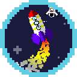
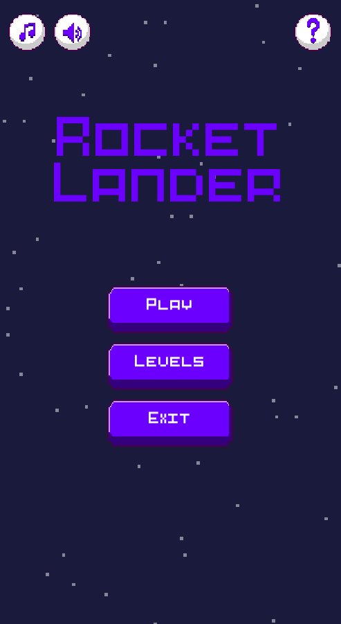

# Rocket Lander

  

## What am I ?

Solo development 2D "Lunar Lander" style mobile game made in Unity.

  

## Development

This project was developed in Unity 2019.2.13

## References
All visual assets were made by myself with [Aseprite](https://www.aseprite.org/). based in these references:
- _Rocket_: [1](https://www.shutterstock.com/video/clip-1022743201-pixel-art-style-rocket-taking-off-animated) [2](https://www.carstickers.com/products/stickers/8-bit-pixel-art-car-stickers-decals/marketplace/pixel-art-flying-rocket-sticker/)
- _Rocket fire particles_:[1](https://www.shutterstock.com/video/clip-1022743201-pixel-art-style-rocket-taking-off-animated)
- _Astronaut_: [1](https://www.amazon.com/Pixel-Astronaut-98930-Travel-Poster/dp/B07T24VSXK)
- _Buttons_: [1](https://answers.unity.com/questions/1598188/how-can-i-make-ui-button-animaion-using-spriteshee.html)
- _UI Interface_: [1](https://www.google.com/imgres?imgurl=https%3A%2F%2Fimage.shutterstock.com%2Fimage-vector%2Fgame-ui-kit-complete-menu-600w-1043927653.jpg&imgrefurl=https%3A%2F%2Fwww.shutterstock.com%2Fes%2Fimage-vector%2Fgame-ui-kit-complete-menu-graphical-1043927653&docid=YrXxewPW5Fh1QM&tbnid=YNsQErHZRLOEoM%3A&vet=1&w=600&h=481&bih=969&biw=1920&ved=2ahUKEwjO7PD_77DmAhUO1RoKHT7BChcQxiAoA3oECAEQHQ&iact=c&ictx=1)
- _Timer icon_: [1](https://www.iconfinder.com/icons/523566/clock_hourglass_pixel-art_productivity_sand_time_timer_icon)
- _Fuel icon_: [1](http://www.iconarchive.com/show/outline-icons-by-iconsmind/Fuel-icon.html)
- _Badge icon_: [1](https://www.123rf.com/photo_89956598_stock-vector-military-star-reward-medal-filled-outline-icon-line-vector-sign-linear-colorful-pictogram-isolated-o.html)
- _Flag icon_: [1](https://sp.depositphotos.com/179012242/stock-illustration-poland-pixel-flag-pixelated-banner.html)
- _Tile end_: [1](https://www.google.com/imgres?imgurl=https%3A%2F%2Fpbs.twimg.com%2Fmedia%2FEErIPZFWwAEYZBj.png&imgrefurl=https%3A%2F%2Ftwitter.com%2Fnorma_2d%3Flang%3Del&docid=0PjS-iFh_fnfmM&tbnid=1UbEYiIsZslUwM%3A&vet=10ahUKEwi94uTU4rzmAhUkBWMBHRxhAIQQMwhUKBMwEw..i&w=640&h=360&bih=969&biw=1920&q=space%20station%20pixel%20art&ved=0ahUKEwi94uTU4rzmAhUkBWMBHRxhAIQQMwhUKBMwEw&iact=mrc&uact=8) [2](https://www.google.com/imgres?imgurl=https%3A%2F%2Fpbs.twimg.com%2Fmedia%2FEErIPZFWwAEYZBj.png&imgrefurl=https%3A%2F%2Ftwitter.com%2Fnorma_2d%3Flang%3Del&docid=0PjS-iFh_fnfmM&tbnid=1UbEYiIsZslUwM%3A&vet=10ahUKEwi94uTU4rzmAhUkBWMBHRxhAIQQMwhUKBMwEw..i&w=640&h=360&bih=969&biw=1920&q=space%20station%20pixel%20art&ved=0ahUKEwi94uTU4rzmAhUkBWMBHRxhAIQQMwhUKBMwEw&iact=mrc&uact=8#h=360&imgdii=QiFq3QQPVRJ44M:&vet=10ahUKEwi94uTU4rzmAhUkBWMBHRxhAIQQMwhUKBMwEw..i&w=640) [3](https://play.google.com/store/apps/details?id=com.puppetbox.lunarmission&hl=es_419) [4](https://www.spokesman.com/blogs/tech-deck/2015/oct/19/weeks-free-game-lunar-lander/)

### Assets
- _Rocket fire loop sound effect_: [freesound (qubodup)](https://freesound.org/people/qubodup/sounds/146770/)
- _Rocket explosion sound effect_: [freesound (zonkmachine)](https://freesound.org/people/zonkmachine/sounds/164854/)
- _UI Button click sound_: [Kenney Assets](https://www.kenney.nl/assets/ui-audio)
- _Menu music_: [melodyloops (Feel The Space - Alexander Lisenkov)](https://www.melodyloops.com/tracks/feel-the-space/)
- _Level music_: [melodyloops (Airspace - John Radford)](https://www.melodyloops.com/tracks/airspace/)

### Tutorials
- _Lunar Lander (1979 Atari)_: [Old Classic Retro Gaming](https://www.youtube.com/watch?v=McAhSoAEbhM)
- _MoonLander Flash Game_: [Moonlander](http://moonlander.seb.ly/)
- _How do I make a rocket?_: [Unity Answers](https://answers.unity.com/questions/1267957/how-do-i-make-a-rocket.html)
- _CREAR BARRAS DE PROGRESO EN UNITY_: [COMO SE HACE](https://www.youtube.com/watch?v=8_aUmH7qCFA)
- _2D Animation in Unity (Tutorial)_: [Brackeys](https://www.youtube.com/watch?v=hkaysu1Z-N8)
- _Fall off left side of screen and spawn on right_: [Unity Answers](https://answers.unity.com/questions/276836/fall-off-left-side-of-screen-and-spawn-on-right.html?_ga=2.121543373.457096014.1574254355-724289559.1547572133)
- _How to create Level Unlock feature in Unity game?_: [Alexander Zotov](https://www.youtube.com/watch?v=Pv1Bi6ao_J8)
- _level Menu with level lock and unlock in unity_: [Fast Solution](https://www.youtube.com/watch?v=8wcEOoLTwOE)
- _E27 UNLOCK LEVELS) - Unity Tutorial_: [Brackeys](https://www.youtube.com/watch?v=AQpDtrNJAEU)
- _Saving and Loading Data XmlSerializer_: [Unity wiki](https://wiki.unity3d.com/index.php/Saving_and_Loading_Data:_XmlSerializer)
- _Rocket particles_: [Warcher devlog](https://warcher-devlog.tumblr.com/post/131193823198/unity-pixel-art-particles)
- _Tilemap_: [Unity Documentation](https://docs.unity3d.com/Manual/class-Tilemap.html)
- _TILEMAPS in Unity_: [Brackeys](https://www.youtube.com/watch?v=ryISV_nH8qw)
- _How to Make a Simple Explosion in Unity 3D_: [AustinU25](https://www.youtube.com/watch?v=DnpoY8_T4H0)

## License

GNU GPLv3 License

Copyright (c) 2020 Javier Calvo García